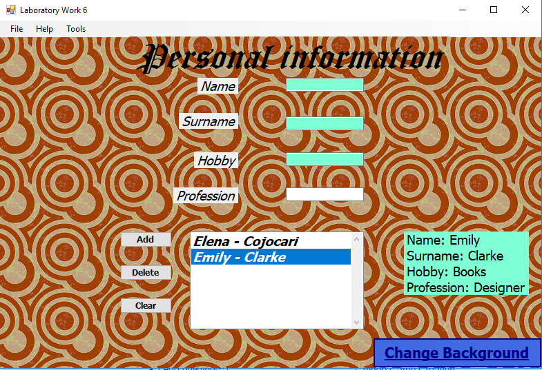

# Windows Programming Laboratory Work #6
## Subject
_Developing using C#._

## Mandatory Objectives
- [x] Create an Win32 or WinRT application using C#
- [x] Convert a previous laboratory work to C#
## Bonus Objectives
- [x] Create a report (3pt)
- [ ] Use WinRT (3pt)
- [ ] Create a pull request with a meaningful fix/feature to 5th WP laboratory work of your colleagues. It should be a project in which you were not involved. (4pt)

## Result
Implemented in C#
* I used winForms
* There are 4 fields where you can eneter your name, surname, hobby and profession
* You can add your information to the list Box
* In the lisbox will appear only your name and surname, when you will click on it, all your enetered information will appear on the right
* you can Delete an item from the box or delete all information from the box
* On button click you can change background image
* Also there is a menu, where you can:
- Start music
- Save all information from listbox into a file
- quit the application 
- To get help

  ## Conclusion
In this laboratory work, I converted first and second laboratories to C#. It was easier to implement all those tasks in C# than in C++, since 
 it is pure object-oriented, takes advantage of the .NET Framework and has a simplified syntax. To open a dialog box you don't have to make another window procedure or you don't need to use resources in order to make a little menu. So, finally I obtained the next result:

